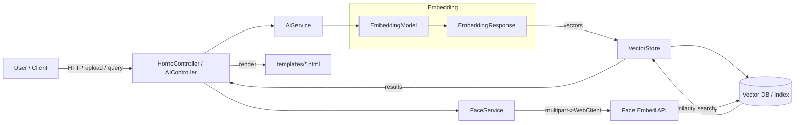

# Chapter 08 — Embeddings & Vector Store (요약)

이 모듈은 임베딩(텍스트/이미지/얼굴) 생성과 벡터 저장소(Vector Store)를 이용한 유사도 검색 예제를 제공합니다.

핵심 개념

- 임베딩(Embedding): 입력(문장, 이미지, 얼굴 등)을 고정 길이의 실수 벡터로 변환하여 의미적 유사도를 계산할 수 있게 합니다.
- 임베딩 모델: `EmbeddingModel`을 통해 임베딩을 생성하고 `EmbeddingResponse`로 메타데이터와 결과를 확인합니다.
- 벡터 저장소(VectorStore): 생성한 벡터와 문서/메타데이터를 저장하고 유사도 검색(similarity search)을 제공합니다.
- 필터링/스코어링: `SearchRequest`에 `topK`, `similarityThreshold`, `filterExpression` 등을 사용해 검색 결과를 제어할 수 있습니다.
- DB 통합: 예제에는 JDBC(Postgres) 기반 벡터 저장(예: `::vector` 타입) 및 SQL 유사도 연산 사용 사례가 포함되어 있습니다.

예제 문서

- 텍스트 임베딩: [docs/text-embedding.md](docs/text-embedding.md)
- 이미지 임베딩: [docs/image-embedding.md](docs/image-embedding.md)
- 문서 저장소 & 검색: [docs/document-search.md](docs/document-search.md)
- 얼굴 임베딩(서비스 연동 + DB 저장): [docs/face-embedding.md](docs/face-embedding.md)

파일 위치(주요)

- 서비스 구현: `src/main/java/com/example/demo/service/AiService.java`, `FaceService.java`
- 컨트롤러/템플릿: `src/main/java/com/example/demo/controller`, `src/main/resources/templates/*`
- DB 초기화: `src/main/resources/sql/table.sql`

빠른 검증 체크리스트

- [ ] `./gradlew :ch08-embedding-vector-store:build`가 성공하는가?
- [ ] `AiService.textEmbedding()` 호출 시 `EmbeddingResponse`와 차원 정보가 로그에 출력되는가?
- [ ] `AiService.addDocument()`로 문서를 추가한 뒤 `searchDocument1/2()`에서 적절한 결과가 반환되는가?
- [ ] `FaceService`의 외부 얼굴 임베딩 API(로컬 또는 테스트 서버)와 연동해 벡터를 얻고 DB에 저장/검색이 가능한가?

추가 학습 포인트

- 인덱싱 전략: 대규모 데이터에서는 HNSW 같은 근사 근접 이웃(ANN) 인덱스 사용을 고려하세요.
- 스케일링: 벡터 차원과 검색 비용 사이의 트레이드오프를 이해하고 모델·index 설정을 튜닝하세요.
- 필터 표현식: 메타데이터 필터링으로 도메인 제약을 결합하면 검색 정확도가 올라갑니다.
- 정확도·성능 측정: 정밀도/재현율, 쿼리당 평균 지연(latency), 비용(모델 호출·스토리지)을 측정하세요.
