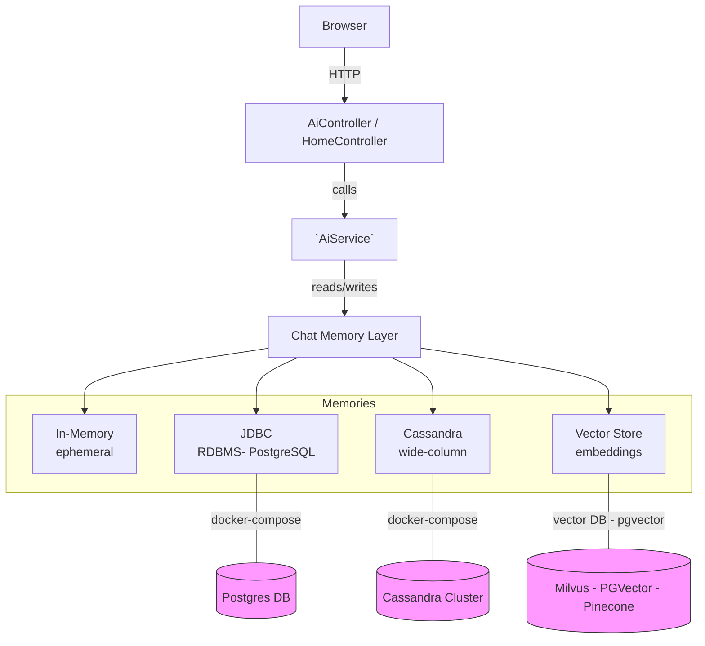

# ch09 — Chat Memory Implementations (한국어)

이 장에는 여러 채팅 메모리 백엔드 예제가 포함되어 있습니다. 아래 링크에서 각 구현의 README를 확인하세요.

- [인메모리 구현](ch09-in-memory-chat-memory/README.md): 개발용으로 빠르고 일시적인 메모리.
- [JDBC 구현](ch09-jdbc-chat-memory/README.md): 관계형 DB 영구 저장(포스트그레스 스키마 포함).
- [Cassandra 구현](ch09-cassandra-chat-memory/README.md): 높은 처리량을 위한 wide-column 스토어.
- [벡터 스토어 구현](ch09-vector-store-chat-memory/README.md): 임베딩과 유사도 검색을 통한 의미 기반 검색.

권장 다음 단계:
- 모듈 폴더에서 `docker-compose up`으로 필요한 DB를 시작하세요(해당 모듈에 docker-compose가 있는 경우).
- 각 모듈의 `application.properties`에서 자격증명과 엔드포인트를 확인하세요.

## 아키텍처

