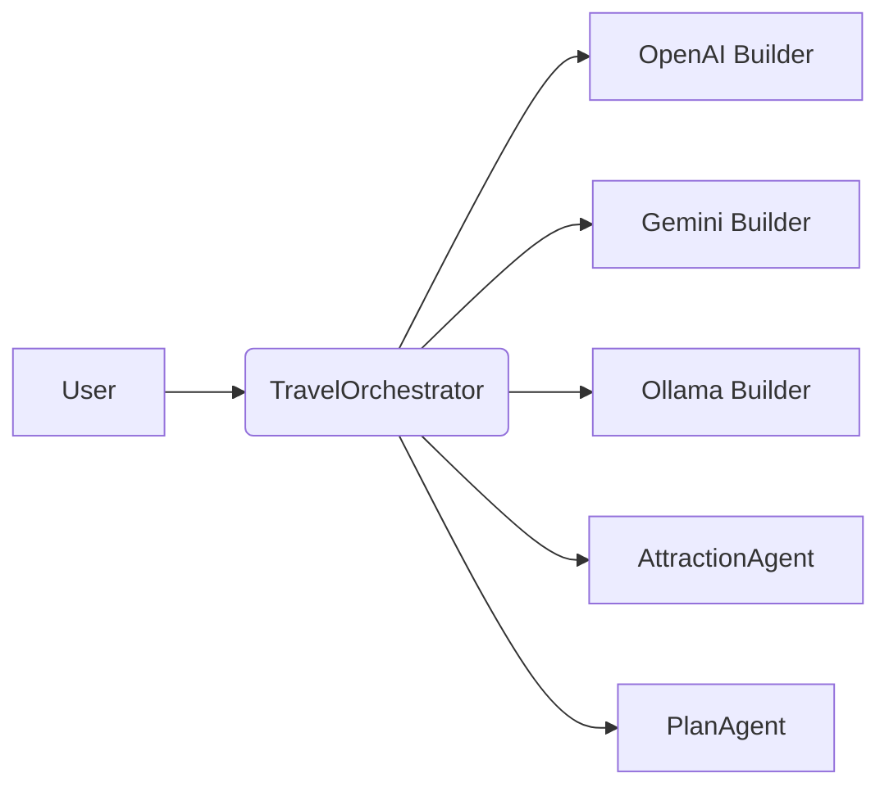

# ch14-multi-agent-with-multi-llm

This module extends the multi-agent orchestrator to support multiple LLM providers via Spring beans.

- **Purpose**: Demonstrate wiring multiple ChatClient builders (OpenAI, Gemini, Ollama) and how agents can be executed with different underlying LLMs.
- **Key files**: `config/LlmConfig.java` (builder beans), `TravelOrchestrator`, per-agent classes.

See the detailed docs:

- **Architecture**: [Architecture](architecture.md)
- **LLM config**: [LLM configuration notes](llm-config.md)
- **Run examples**: [Run & examples](run-examples.md)

Highlights:

- `LlmConfig` defines multiple `ChatClient.Builder` beans qualified by `openaiBuilder`, `geminiBuilder`, `ollamaBuilder`, and a `@Primary` default.
- Inject builders with `@Qualifier` when you need to target a specific provider, or use the primary builder for a default provider.

Terminology

- `TravelOrchestrator`: central orchestrator — parses user queries and calls `@Tool` agent methods.
- `Plan`: DTO representing a travel plan (use `Plan` in code and 'plan' in text where appropriate).
- `Agent`: a domain specialist component (e.g., `AttractionAgent`).

Key learning notes

- Design: prefer small, single-responsibility agents and keep orchestration logic focused on delegation.
- Prompting: enforce strict output formats (JSON) and include repair prompts and schema validation where possible.
- Multi-LLM: profile token usage, latency and output differences per provider and add provider-specific extraction/normalization if needed.
- Observability: collect prompt/response logs (mask secrets), token metrics, and latency/failure metrics to monitor quality.

