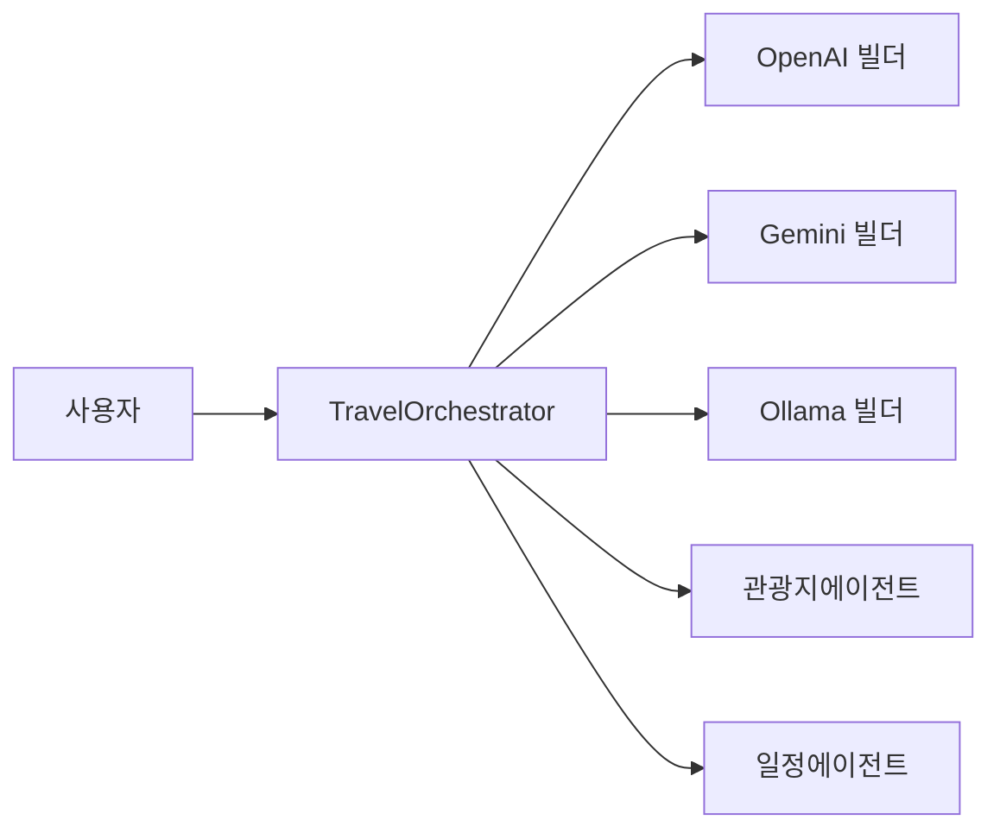

# ch14-multi-agent-with-multi-llm

이 모듈은 멀티 에이전트 조율 아키텍처에 여러 LLM 공급자를 연결하는 예제를 보여줍니다.

- **목적**: OpenAI, Google Gemini, Ollama 등 서로 다른 LLM 공급자에 대해 `ChatClient.Builder`를 등록하고, 에이전트를 각 공급자별로 실행하는 방법을 설명합니다.
- **핵심 파일**: `config/LlmConfig.java`(빌더 빈), `TravelOrchestrator`, 개별 에이전트들.

상세 문서:

- **아키텍처**: [architecture_ko.md](architecture_ko.md)
- **LLM 설정**: [llm-config_ko.md](llm-config_ko.md)
- **실행 및 예제**: [run-examples_ko.md](run-examples_ko.md)

하이라이트:

- `LlmConfig`는 `openaiBuilder`, `geminiBuilder`, `ollamaBuilder` 같은 여러 `ChatClient.Builder` 빈을 등록합니다.
- 특정 공급자를 사용하려면 컴포넌트에서 `@Qualifier`로 해당 빌더를 주입받아 사용하면 됩니다.

용어 정리

- `TravelOrchestrator`: 중앙 조율자 — 사용자 질의를 파싱하고 `@Tool` 에이전트 메서드를 호출합니다.
- `Plan`(`일정`): 코드 내 DTO(여행 일정) — 문서에서는 `Plan`과 '일정'을 병기합니다.
- `Agent`(예: `AttractionAgent`): 특정 도메인 담당 컴포넌트.

학습 포인트 요약

- 설계: 단일 책임 원칙을 따르는 작은 에이전트를 만들고 조율자는 위임에 집중합니다.
- 프롬프트: 출력 포맷(JSON) 강제 및 수리/스키마 검증 추가 권장.
- 멀티-LLM: 공급자별 토큰·지연·출력 차이를 프로파일링하고 공급자별 정규화 로직을 마련하세요.
- 관찰성: 프롬프트/응답 로그(민감정보 마스킹), 토큰 메트릭, 지연/오류 모니터링을 수집하세요.

