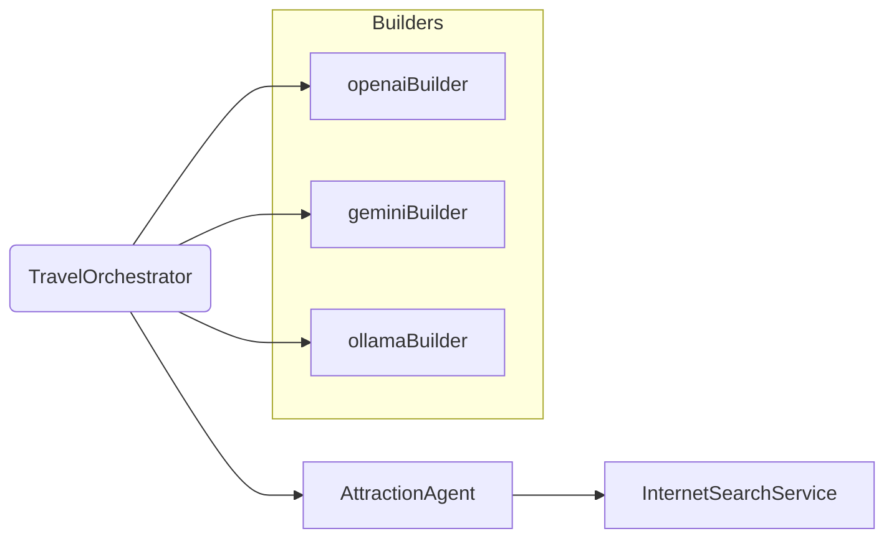

# Architecture

This module shares the same orchestrator/agent architecture as `ch14-multi-agent` with an additional focus on multi-LLM wiring.

Differences vs single-LLM module:

- `LlmConfig` provides multiple `ChatClient.Builder` beans qualified for different providers.
- Agents and orchestrator can build provider-specific `ChatClient` instances via the appropriate builder.

Flow highlights

- Select builder: obtain a `ChatClient.Builder` from the context (optionally by `@Qualifier`) and call `build()` to create a provider-specific `ChatClient`.
- Behavior and token usage may vary across providers; prompts and repair strategies remain the same.
