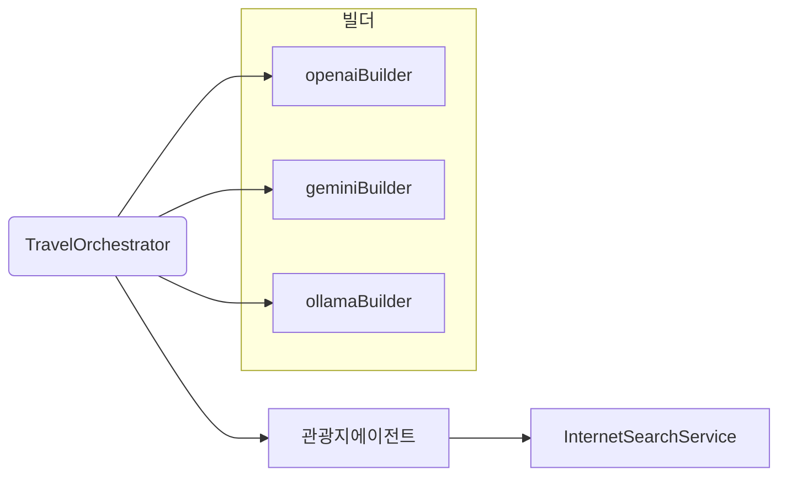

# 아키텍처 (한국어 번역)

이 모듈은 `ch14-multi-agent`와 같은 조율자/에이전트 아키텍처를 공유하지만, 여러 LLM 공급자(Provider)를 연결하는 설정에 중점을 둡니다.

단일 LLM 모듈과의 차이점

- `LlmConfig`는 서로 다른 공급자별로 구분된 여러 `ChatClient.Builder` 빈을 제공합니다.
- 에이전트와 조율자는 적절한 빌더를 사용해 공급자별 `ChatClient` 인스턴스를 생성할 수 있습니다.

흐름 요약

- 빌더 선택: 컨텍스트에서 `ChatClient.Builder`를 얻고(선택적으로 `@Qualifier` 사용) `build()`를 호출해 특정 공급자용 `ChatClient`를 생성합니다.
- 공급자별 동작 차이: 프롬프트 동작과 JSON 수리(repair) 전략은 동일하지만, 토큰 사용량 표기나 메타데이터 형상은 공급자마다 다를 수 있습니다.
