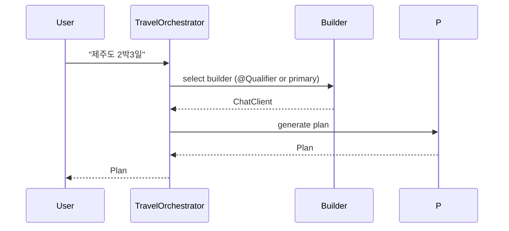

# Run & examples

Build

- From workspace root:

  - `./gradlew :ch14-multi-agent-with-multi-llm:bootJar`

- Or run the module directly:

  - `cd ch14-multi-agent-with-multi-llm && ../gradlew bootRun`

Selecting LLM provider

- The module registers multiple `ChatClient.Builder` beans. To run the application with a particular provider as default, set up provider credentials in environment and ensure the `LlmConfig` primary bean is the desired one, or modify the code to `@Primary` a different builder.

Running with JVM properties

- Use `-D` options with `java -jar` or `spring-boot.run.jvmArguments` for Gradle `bootRun` as shown in the single-LLM module docs.

Notes

- Token usage and some behaviors differ by provider; test prompts across providers and adjust repair prompts where necessary.
