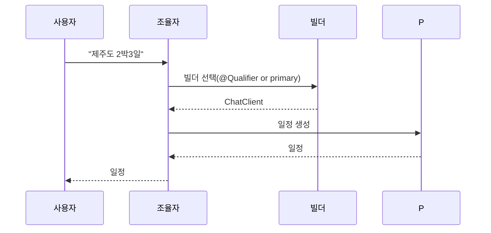

# 실행 및 예제 (한국어 번역)

빌드

- 워크스페이스 루트에서:

  - `./gradlew :ch14-multi-agent-with-multi-llm:bootJar`

- 또는 모듈 디렉터리로 이동하여 실행:

  - `cd ch14-multi-agent-with-multi-llm && ../gradlew bootRun`

LLM 공급자 선택

- 모듈은 여러 `ChatClient.Builder` 빈을 등록합니다. 특정 공급자를 기본으로 사용하려면 환경에 해당 공급자의 자격증명을 설정하고, 필요 시 `LlmConfig`의 `@Primary` 설정을 변경하거나 코드에서 `@Qualifier`로 명시적으로 빌더를 주입하세요.

JVM 프로퍼티 전달

- `-D` 옵션은 `java -jar`로 JAR을 실행하거나 Gradle `bootRun`에서 `spring-boot.run.jvmArguments`를 통해 전달하세요(단일-LLM 모듈의 예와 동일).

주의

- 공급자별로 토큰 사용량 표기와 응답 형식이 달라질 수 있으므로, 여러 공급자에서 프롬프트를 테스트하고 필요하면 수리(repair) 프롬프트를 조정하세요.
