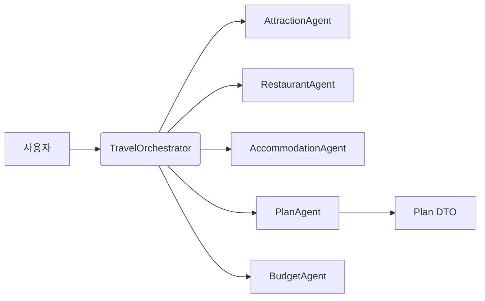

# ch14-multi-agent



This module demonstrates a tool-based multi-agent orchestration pattern using Spring AI.

- **Purpose**: Coordinate multiple specialist agents (Attraction, Restaurant, Accommodation, Plan, Budget) to answer travel planning requests and generate structured travel plans.
- **Key components**: TravelOrchestrator, AttractionAgent, RestaurantAgent, AccommodationAgent, PlanAgent, BudgetAgent.
- **Patterns**: Tool-based agent methods (@Tool), SSE progress events, parallel information collection, LLM-driven parsing and entity mapping.

See the detailed docs:

- **Architecture**: [Architecture](architecture.md)
- **Agents**: [Agents reference](agents.md)
- **Run examples**: [Run & examples](run-examples.md)

Highlights:

- The orchestrator exposes tool methods that an LLM can call to delegate work to expert agents.
- Agents use curated system and user prompt templates and attempt to return JSON-serializable entities.
- The orchestrator uses an InheritableThreadLocal to propagate SSE emitters to worker threads for real-time progress.

Terminology

- `TravelOrchestrator`: 중앙 조율자(엔트리포인트) — 사용자의 질의를 파싱하고 적절한 `@Tool` 메서드(에이전트)를 호출합니다.
- `Plan`: 코드 내 DTO(여행 일정) — 문서에서는 영어 `Plan`과 한국어 `일정`을 병기합니다.
- Agent(예: `AttractionAgent`): 특정 도메인(관광지/맛집/숙소)을 담당하는 컴포넌트.

Learning notes

- Design: prefer small, single-responsibility agents and keep orchestration logic lightweight.
- Prompting: enforce strict output formats (JSON) and include repair prompts for robustness.
- Observability: log prompts/responses (mask secrets), collect token metrics, and monitor latencies.

What you should know

- Agent responsibilities: agents are domain specialists; keep their surface area minimal and return typed DTOs when possible.
- Tool-based orchestration: the orchestrator exposes `@Tool` methods so an LLM can programmatically invoke agents — design tools to be idempotent and side-effect safe.
- Concurrency & SSE: worker threads run in parallel; use `InheritableThreadLocal` carefully to propagate `SseEmitter` instances and avoid blocking I/O in threads.
- Prompt engineering: prefer short, deterministic system prompts, include examples of expected JSON, and add repair prompts for malformed outputs.
- Testing: unit-test agent logic and use integration tests that mock `ChatClient` responses for deterministic behavior.

Example walkthrough

1. User submits free-text request (e.g., "Plan a 3-day, budget-friendly trip to Jeju").
2. `TravelOrchestrator.parseUserQuery()` extracts structured `Requirements` via an LLM call.
3. Orchestrator calls agents in parallel (`AttractionAgent`, `RestaurantAgent`, `AccommodationAgent`) to collect DTOs.
4. `PlanAgent` assembles collected DTOs and requests a final `Plan` entity from the LLM.
5. `BudgetAgent` validates costs and triggers a replan if the budget is exceeded.

Run the app (example):

```bash
cd ch14-multi-agent
../gradlew bootRun
# then open http://localhost:8080/travel-multi-agent
```

Extra notes & recommended reading

- Use `ChatClient.entity(...)` to convert LLM responses directly into DTOs and centralize JSON repair logic in a helper.
- Be mindful of cost: batch or stub LLM calls in unit tests and add caching for repeated searches.
- Security: never log raw user inputs or API keys; sanitize logs and redact tokens.
- Observability: add metrics for per-agent latency and per-request token consumption to identify expensive steps.
- When extending to multiple LLMs (see `ch14-multi-agent-with-multi-llm`), abstract provider-specific parsing and rate-limiting into a small adapter layer.

## What was learned in this chapter

- **Tool-based Multi-Agent Orchestration**: How to design and implement a system where a central orchestrator (LLM-driven) delegates tasks to specialized agents using `@Tool` methods.
- **Agent Design Principles**: Applying the Single Responsibility Principle for agents, keeping them focused on specific domains (e.g., attractions, restaurants). Agents should return typed DTOs.
- **LLM-driven Parsing and Entity Mapping**: Using LLMs to extract structured data (DTOs) from free-text inputs and to generate complex entities (like a `Plan`).
- **Robust Prompt Engineering**: Crafting effective system/user prompts, including explicit JSON schema examples, and implementing repair prompts for malformed LLM outputs.
- **Concurrency and Real-time Updates**: Handling parallel execution of agents and propagating `SseEmitter` instances using `InheritableThreadLocal` for real-time progress updates to the UI.
- **Observability**: The importance of logging prompts/responses, token metrics, and latency monitoring for debugging and cost management.
- **Testing Strategies**: Unit testing agent logic and mocking `ChatClient` for deterministic integration tests.

## Core content of examples

- **Travel Planning Scenario**: A practical application of multi-agent systems to generate a comprehensive travel plan (attractions, restaurants, accommodation, budget).
- **User Query to Structured Requirements**: Demonstrates how an LLM can transform a natural language request ("Plan a 3-day, budget-friendly trip to Jeju") into structured `Requirements`.
- **Parallel Information Gathering**: Shows concurrent calls to multiple agents (`AttractionAgent`, `RestaurantAgent`, `AccommodationAgent`) to collect diverse data.
- **Plan Assembly and Validation**: How a `PlanAgent` combines collected data to create a final `Plan` and how a `BudgetAgent` validates it, potentially triggering a replan.
- **SSE for UI Feedback**: Illustrates how Server-Sent Events (SSE) provide real-time progress updates to the user during the multi-step agent execution.
- **JSON Output Enforcement**: Examples of how prompts are engineered to force LLMs to return JSON-serializable DTOs.

## Additional learning topics

- **Advanced JSON Schema Validation & Repair**: Deeper dive into robust validation beyond simple repair prompts, potentially using external schema validators.
- **Cost Management & Optimization**: Detailed strategies for LLM cost control, including advanced caching, batching, and token usage analysis across different LLM providers.
- **Security Best Practices**: Comprehensive guidelines for input sanitization, output masking, and secure handling of sensitive information (API keys, user data).
- **Production-grade Observability**: Implementing advanced monitoring, alerting, and distributed tracing for multi-agent systems.
- **LLM Provider Abstraction**: Designing a flexible adapter layer for seamless integration and switching between multiple LLM providers (as hinted by `ch14-multi-agent-with-multi-llm`).
- **Tool Design Principles (Idempotency & Side Effects)**: More detailed exploration of designing `@Tool` methods to be idempotent and side-effect safe for reliable agent interactions.
- **Error Handling and Resilience**: Implementing retry mechanisms with exponential backoff, circuit breakers, and fallback strategies for external service calls and LLM interactions.
- **Human-in-the-Loop**: Exploring scenarios where human intervention is required for complex decisions or validation.
