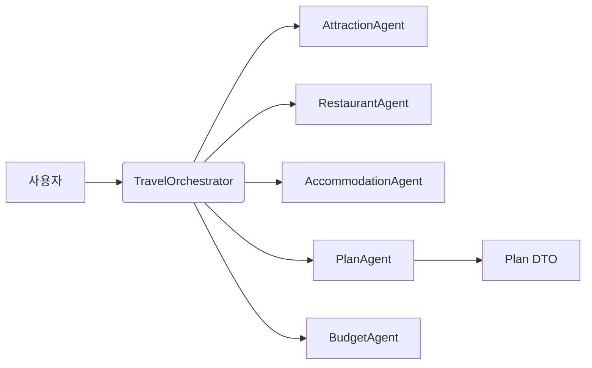

# ch14-multi-agent

This module demonstrates a tool-based multi-agent orchestration pattern using Spring AI.

- **Purpose**: Coordinate multiple specialist agents (Attraction, Restaurant, Accommodation, Plan, Budget) to answer travel planning requests and generate structured travel plans.
- **Key components**: TravelOrchestrator, AttractionAgent, RestaurantAgent, AccommodationAgent, PlanAgent, BudgetAgent.
- **Patterns**: Tool-based agent methods (@Tool), SSE progress events, parallel information collection, LLM-driven parsing and entity mapping.

See the detailed docs:

- **Architecture**: [Architecture](architecture.md)
- **Agents**: [Agents reference](agents.md)
- **Run examples**: [Run & examples](run-examples.md)

Highlights:

- The orchestrator exposes tool methods that an LLM can call to delegate work to expert agents.
- Agents use curated system and user prompt templates and attempt to return JSON-serializable entities.
- The orchestrator uses an InheritableThreadLocal to propagate SSE emitters to worker threads for real-time progress.

Terminology

- `TravelOrchestrator`: 중앙 조율자(엔트리포인트) — 사용자의 질의를 파싱하고 적절한 `@Tool` 메서드(에이전트)를 호출합니다.
- `Plan`: 코드 내 DTO(여행 일정) — 문서에서는 영어 `Plan`과 한국어 `일정`을 병기합니다.
- Agent(예: `AttractionAgent`): 특정 도메인(관광지/맛집/숙소)을 담당하는 컴포넌트.

Learning notes

- Design: prefer small, single-responsibility agents and keep orchestration logic lightweight.
- Prompting: enforce strict output formats (JSON) and include repair prompts for robustness.
- Observability: log prompts/responses (mask secrets), collect token metrics, and monitor latencies.
