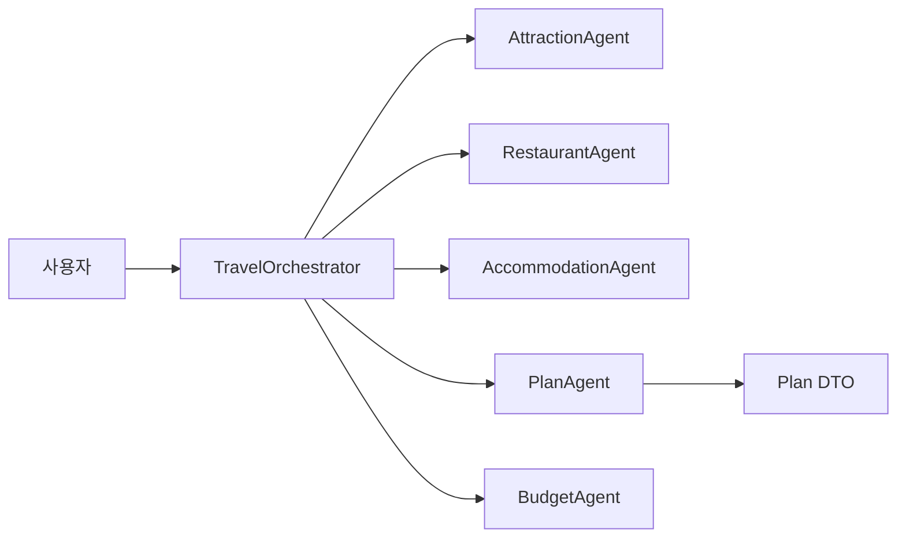

# ch14-multi-agent



이 모듈은 Spring AI를 사용한 도구 기반 멀티 에이전트 조율 패턴을 보여줍니다.

- **목적**: 여러 전문 에이전트(관광지, 맛집, 숙소, 일정, 예산)를 조율하여 여행 계획 요청에 응답하고 구조화된 여행 일정을 생성합니다.
- **핵심 구성요소**: `TravelOrchestrator`, `AttractionAgent`, `RestaurantAgent`, `AccommodationAgent`, `PlanAgent`, `BudgetAgent`.
- **사용된 패턴**: `@Tool` 기반 에이전트 메서드, SSE 진행 이벤트, 병렬 정보 수집, LLM을 이용한 파싱 및 엔티티 매핑.

상세 문서:

- **아키텍처**: [architecture_ko.md](architecture_ko.md)
- **에이전트 참고**: [agents_ko.md](agents_ko.md)
- **실행 및 예제**: [run-examples_ko.md](run-examples_ko.md)

하이라이트:

- 조율자는 LLM이 호출할 수 있는 도구 메서드를 노출하여, LLM이 적절한 전문 에이전트를 선택하도록 합니다.
- 에이전트는 시스템/사용자 프롬프트 템플릿을 사용하며, JSON 직렬화 가능한 DTO를 반환하려고 시도합니다.
- 조율자는 `InheritableThreadLocal`을 사용해 비동기 작업 스레드에 SSE 발신자를 전달하여 실시간 진행 표시를 지원합니다.

용어 정리

- `TravelOrchestrator`: 중앙 조율자 — 사용자 질의를 파싱하고 적절한 `@Tool` 메서드를 호출합니다.
- `Plan`(`일정`): 코드 내 DTO(여행 일정) — 문서에서는 `Plan`과 '일정'을 병기합니다.
- `Agent`(예: `AttractionAgent`): 특정 도메인을 담당하는 컴포넌트.

학습 포인트 요약

- 설계: 단일 책임 원칙에 따라 작은 에이전트를 구성하고, 조율자는 가벼운 오케스트레이션만 수행합니다.
- 프롬프트: 출력 포맷(JSON)을 강제하고 수리 프롬프트를 포함해 견고성을 높이세요.
- 관찰성: 프롬프트/응답(민감정보 마스킹) 로그, 토큰 메트릭, 응답 지연 모니터링을 수집하세요.

알아야 할 내용

- 에이전트 책임: 에이전트는 도메인 전문가로 설계하고 인터페이스(메서드)를 최소화하며 가능한 경우 DTO를 반환하세요.
- 도구 기반 조율: 조율자는 `@Tool`로 메서드를 노출해 LLM이 에이전트를 호출하도록 합니다. 도구는 멱등성(idempotent)과 부작용 안전성을 고려하세요.
- 동시성 및 SSE: 워커 스레드는 병렬 실행됩니다. `SseEmitter`를 `InheritableThreadLocal`로 전달할 때 블로킹 I/O를 피하세요.
- 프롬프트 엔지니어링: 짧고 결정적인 시스템 프롬프트를 선호하고, 기대하는 JSON 예시와 수리 프롬프트를 포함하세요.
- 테스트: 에이전트 로직은 단위 테스트로 검증하고 `ChatClient`는 모킹해 통합 테스트를 안정적으로 만드세요.

예제 흐름

1. 사용자가 자유 텍스트(예: "제주 3일 예산형 여행 계획")을 전송합니다.
2. `TravelOrchestrator.parseUserQuery()`가 LLM 호출로 `Requirements`를 추출합니다.
3. 조율자는 `AttractionAgent`, `RestaurantAgent`, `AccommodationAgent`를 병렬로 호출해 DTO를 수집합니다.
4. `PlanAgent`는 수집한 DTO를 조합해 LLM에 `Plan` 엔티티 생성을 요청합니다.
5. `BudgetAgent`가 비용을 검증하고 초과 시 재계획(replan)을 트리거합니다.

실행 예시:

```bash
cd ch14-multi-agent
../gradlew bootRun
# 브라우저에서 http://localhost:8080/travel-multi-agent 열기
```

추가 팁

- `ChatClient.entity(...)`를 사용해 LLM 응답을 DTO로 바로 매핑하고, JSON 수리 로직은 중앙 헬퍼로 모으세요.
- 비용 관리: 단위 테스트에서는 LLM 호출을 스텁/모킹하고, 반복 검색에 캐시를 적용하세요.
- 보안: 원문 입력이나 API 키를 로깅하지 말고 로그를 마스킹하세요.
- 관찰성: 에이전트별 지연 시간과 요청별 토큰 사용량을 계측해 비용이 큰 단계를 식별하세요.
- 다중 LLM 확장: `ch14-multi-agent-with-multi-llm`을 참고해 프로바이더 어댑터 계층(파싱/레이트리밋)을 분리하세요.

## 이 챕터에서 배운 내용

- **도구 기반 멀티 에이전트 조율**: 중앙 조율자(LLM 기반)가 `@Tool` 메서드를 사용하여 전문 에이전트에게 작업을 위임하는 시스템을 설계하고 구현하는 방법.
- **에이전트 설계 원칙**: 에이전트가 특정 도메인(예: 관광지, 맛집)에 집중하도록 단일 책임 원칙을 적용하는 방법. 에이전트는 타입이 지정된 DTO를 반환해야 합니다.
- **LLM 기반 파싱 및 엔티티 매핑**: LLM을 사용하여 자유 텍스트 입력에서 구조화된 데이터(DTO)를 추출하고 복잡한 엔티티(예: `Plan`)를 생성하는 방법.
- **견고한 프롬프트 엔지니어링**: 효과적인 시스템/사용자 프롬프트 작성, 명시적인 JSON 스키마 예시 포함, 잘못된 LLM 출력에 대한 수리 프롬프트 구현.
- **동시성 및 실시간 업데이트**: 에이전트의 병렬 실행 처리 및 `InheritableThreadLocal`을 사용하여 `SseEmitter` 인스턴스를 전파하여 UI에 실시간 진행 상황을 업데이트하는 방법.
- **관찰성**: 디버깅 및 비용 관리를 위한 프롬프트/응답 로깅, 토큰 메트릭, 지연 시간 모니터링의 중요성.
- **테스트 전략**: 에이전트 로직 단위 테스트 및 `ChatClient`를 모킹하여 결정론적 통합 테스트를 수행하는 방법.

## 예제 내용 핵심

- **여행 계획 시나리오**: 멀티 에이전트 시스템을 사용하여 포괄적인 여행 계획(관광지, 맛집, 숙소, 예산)을 생성하는 실제 애플리케이션.
- **사용자 질의를 구조화된 요구사항으로 변환**: LLM이 자연어 요청("제주 3일 예산형 여행 계획")을 구조화된 `Requirements`로 변환하는 방법 시연.
- **병렬 정보 수집**: 여러 에이전트(`AttractionAgent`, `RestaurantAgent`, `AccommodationAgent`)에 대한 동시 호출을 통해 다양한 데이터를 수집하는 방법.
- **계획 조립 및 검증**: `PlanAgent`가 수집된 데이터를 결합하여 최종 `Plan`을 생성하고 `BudgetAgent`가 이를 검증하여 필요한 경우 재계획을 트리거하는 방법.
- **UI 피드백을 위한 SSE**: 서버 전송 이벤트(SSE)가 다단계 에이전트 실행 중에 사용자에게 실시간 진행 상황 업데이트를 제공하는 방법 설명.
- **JSON 출력 강제**: LLM이 JSON 직렬화 가능한 DTO를 반환하도록 프롬프트가 어떻게 엔지니어링되는지에 대한 예시.

## 추가 학습 내용

- **고급 JSON 스키마 검증 및 수리**: 단순한 수리 프롬프트를 넘어 외부 스키마 유효성 검사기를 사용하는 등 견고한 유효성 검사에 대한 심층 탐구.
- **비용 관리 및 최적화**: 고급 캐싱, 배치 처리, 다양한 LLM에 걸친 토큰 사용량 분석을 포함한 LLM 비용 제어를 위한 상세 전략.
- **보안 모범 사례**: 입력 정제, 출력 마스킹, 민감한 정보(API 키, 사용자 데이터)의 안전한 처리에 대한 포괄적인 지침.
- **프로덕션 수준 관찰성**: 멀티 에이전트 시스템을 위한 고급 모니터링, 경고 및 분산 추적 구현.
- **LLM 공급자 추상화**: 여러 LLM 공급자 간의 원활한 통합 및 전환을 위한 유연한 어댑터 계층 설계(ch14-multi-agent-with-multi-llm에서 힌트).
- **도구 설계 원칙(멱등성 및 부작용)**: 신뢰할 수 있는 에이전트 상호 작용을 위해 `@Tool` 메서드를 멱등성 및 부작용 안전하게 설계하는 방법에 대한 자세한 탐구.
- **오류 처리 및 복원력**: 지수 백오프를 사용한 재시도 메커니즘, 서킷 브레이커, 외부 서비스 호출 및 LLM 상호 작용을 위한 폴백 전략 구현.
- **Human-in-the-Loop**: 복잡한 결정이나 검증을 위해 사람의 개입이 필요한 시나리오 탐색.
