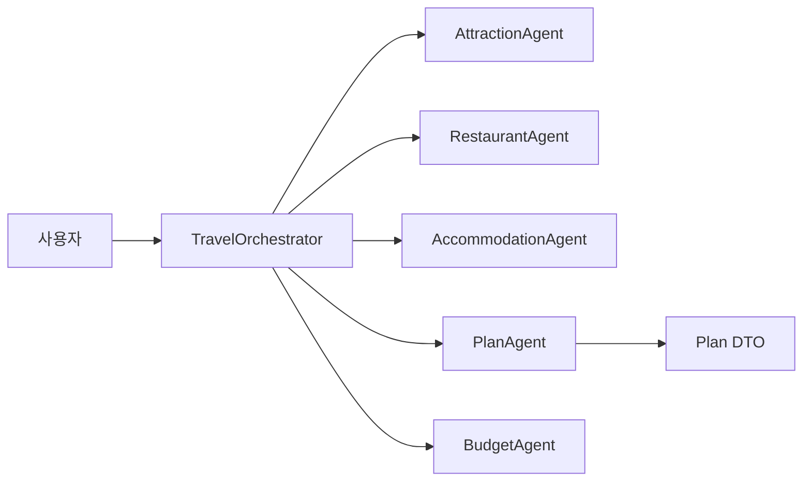

# ch14-multi-agent

이 모듈은 Spring AI를 사용한 도구 기반 멀티 에이전트 조율 패턴을 보여줍니다.

- **목적**: 여러 전문 에이전트(관광지, 맛집, 숙소, 일정, 예산)를 조율하여 여행 계획 요청에 응답하고 구조화된 여행 일정을 생성합니다.
- **핵심 구성요소**: `TravelOrchestrator`, `AttractionAgent`, `RestaurantAgent`, `AccommodationAgent`, `PlanAgent`, `BudgetAgent`.
- **사용된 패턴**: `@Tool` 기반 에이전트 메서드, SSE 진행 이벤트, 병렬 정보 수집, LLM을 이용한 파싱 및 엔티티 매핑.

상세 문서:

- **아키텍처**: [architecture_ko.md](architecture_ko.md)
- **에이전트 참고**: [agents_ko.md](agents_ko.md)
- **실행 및 예제**: [run-examples_ko.md](run-examples_ko.md)

하이라이트:

- 조율자는 LLM이 호출할 수 있는 도구 메서드를 노출하여, LLM이 적절한 전문 에이전트를 선택하도록 합니다.
- 에이전트는 시스템/사용자 프롬프트 템플릿을 사용하며, JSON 직렬화 가능한 DTO를 반환하려고 시도합니다.
- 조율자는 `InheritableThreadLocal`을 사용해 비동기 작업 스레드에 SSE 발신자를 전달하여 실시간 진행 표시를 지원합니다.

용어 정리

- `TravelOrchestrator`: 중앙 조율자 — 사용자 질의를 파싱하고 적절한 `@Tool` 메서드를 호출합니다.
- `Plan`(`일정`): 코드 내 DTO(여행 일정) — 문서에서는 `Plan`과 '일정'을 병기합니다.
- `Agent`(예: `AttractionAgent`): 특정 도메인을 담당하는 컴포넌트.

학습 포인트 요약

- 설계: 단일 책임 원칙에 따라 작은 에이전트를 구성하고, 조율자는 가벼운 오케스트레이션만 수행합니다.
- 프롬프트: 출력 포맷(JSON)을 강제하고 수리 프롬프트를 포함해 견고성을 높이세요.
- 관찰성: 프롬프트/응답(민감정보 마스킹) 로그, 토큰 메트릭, 응답 지연 모니터링을 수집하세요.
