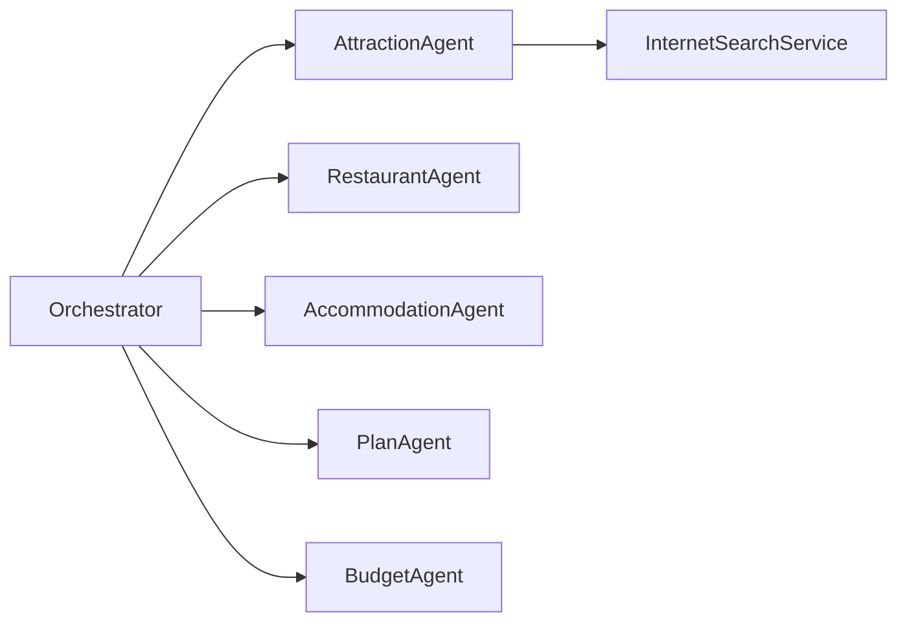

# Agents reference



This file summarizes the responsibilities and notable behaviors of each agent in the module.

- `AttractionAgent`
  - Searches attractions via `InternetSearchService` (`searchAttractions`, `fetchAttractionInfo`).
  - Returns a list of `Attraction` DTOs and normalizes `entranceFee` when missing.
  - Uses a system prompt enforcing JSON-array output and retries once with a repair prompt if parsing fails.

- `RestaurantAgent`
  - Searches restaurants and enriches results. Normalizes `price` when missing using heuristics.
  - Exposes `searchRestaurants` and `fetchRestaurantInfo` tools for web scraping / content enrichment.

- `AccommodationAgent`
  - (Similar pattern) Gathers accommodations and normalizes nightly prices.

- `PlanAgent`
  - Builds a single, detailed travel-plan prompt from collected DTOs and requests a `Plan` entity from the LLM.
  - Enforces formatting rules and cost accounting in the prompt to produce machine-friendly output.

- `BudgetAgent`
  - Analyzes the plan's costs against `PlanState.maxBudget` and sets `BudgetAnalysis` with messages and an `isExceeded` flag.

Notes

- Agents prefer returning strong types (DTOs) via `ChatClient.entity(...)`. They include defensive repair prompts when the LLM returns invalid JSON.
- Tool annotation (`@Tool`) with `returnDirect=true` is used for methods that should return results directly to the orchestrator.

What to know

- DTO-first: define simple POJOs for `Attraction`, `Restaurant`, `Accommodation`, `Plan`, and `BudgetAnalysis`. Use `ChatClient.entity(...)` to map responses.
- Prompt design: include a short system prompt, an explicit JSON schema example, and a repair instruction in the user prompt.

Example prompt (pseudo)

```
System: You are an expert travel data extractor. Always return valid JSON matching the schema.
User: Given the following text, return a JSON array of Attraction objects: [{"name":"...","location":"...","entranceFee":12345}]
Repair: If the response is not valid JSON, try to correct it and output only JSON.
```

Error handling & retries

- If `ChatClient.entity(...)` fails to parse, send a short repair prompt and retry once.
- Log the original LLM output (redact secrets) to aid debugging.

Implementation tip

- Centralize JSON repair logic in a helper method used by all agents. That keeps retry semantics consistent and simplifies testing.

Agent prompt & DTO examples

AttractionAgent (from `AttractionAgent.java`):

System prompt (excerpt):
```
당신은 관광지 추천 전문 에이전트입니다.
## 규칙
1) 관광지 후보는 최소 3개, 최대 6개를 제안하세요.
## 출력 형식
1) 반드시 JSON 배열만 출력하세요.
예) [{"name":"...","address":"...","description":"...","entranceFee":5000}]
```

User prompt template (pseudo):
```
사용자 요청: %s
- 자연/문화/체험 등 다양한 유형을 섞어 관광지를 추천하세요.
- 각 항목에는 name, address, description, entranceFee를 포함하세요.
```

DTO example (`com.example.demo.dto.Attraction`):
```java
@Data
public class Attraction {
  private String name;
  private String address;
  private String description;
  private Integer entranceFee;
}
```

RestaurantAgent (from `RestaurantAgent.java`) prompt excerpt:
```
당신은 맛집 추천 전문 에이전트입니다.
규칙: 맛집 후보는 최소 3개, 최대 5개. 반드시 JSON 배열만 출력.
예) [{"name":"...","address":"...","description":"...","price":12000}]
```

DTO example (`com.example.demo.dto.Restaurant`):
```java
@Data
public class Restaurant {
  private String name;
  private String address;
  private String description;
  private Integer price;
}
```

AccommodationAgent (from `AccommodationAgent.java`) prompt excerpt:
```
당신은 숙소 추천 전문 에이전트입니다.
출력: JSON 배열, 예) [{"name":"...","address":"...","description":"...","pricePerNight":150000}]
```

DTO example (`com.example.demo.dto.Accommodation`):
```java
@Data
public class Accommodation {
  private String name;
  private String address;
  private String description;
  private Integer pricePerNight;
}
```

PlanAgent output DTO (`com.example.demo.dto.Plan`) example (simplified):
```java
@Data
public class Plan {
  private List<DaySchedule> days;
  private Integer maxBudget;
  private Integer totalCost;
  private Integer meals;
  private Integer accommodation;
  private Integer attractions;
}
```
