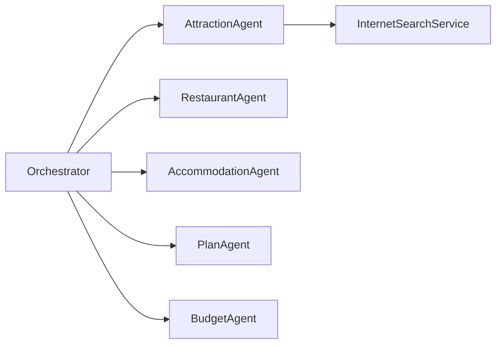

# Agents reference

This file summarizes the responsibilities and notable behaviors of each agent in the module.

- `AttractionAgent`
  - Searches attractions via `InternetSearchService` (`searchAttractions`, `fetchAttractionInfo`).
  - Returns a list of `Attraction` DTOs and normalizes `entranceFee` when missing.
  - Uses a system prompt enforcing JSON-array output and retries once with a repair prompt if parsing fails.

- `RestaurantAgent`
  - Searches restaurants and enriches results. Normalizes `price` when missing using heuristics.
  - Exposes `searchRestaurants` and `fetchRestaurantInfo` tools for web scraping / content enrichment.

- `AccommodationAgent`
  - (Similar pattern) Gathers accommodations and normalizes nightly prices.

- `PlanAgent`
  - Builds a single, detailed travel-plan prompt from collected DTOs and requests a `Plan` entity from the LLM.
  - Enforces formatting rules and cost accounting in the prompt to produce machine-friendly output.

- `BudgetAgent`
  - Analyzes the plan's costs against `PlanState.maxBudget` and sets `BudgetAnalysis` with messages and an `isExceeded` flag.

Notes

- Agents prefer returning strong types (DTOs) via `ChatClient.entity(...)`. They include defensive repair prompts when the LLM returns invalid JSON.
- Tool annotation (`@Tool`) with `returnDirect=true` is used for methods that should return results directly to the orchestrator.
