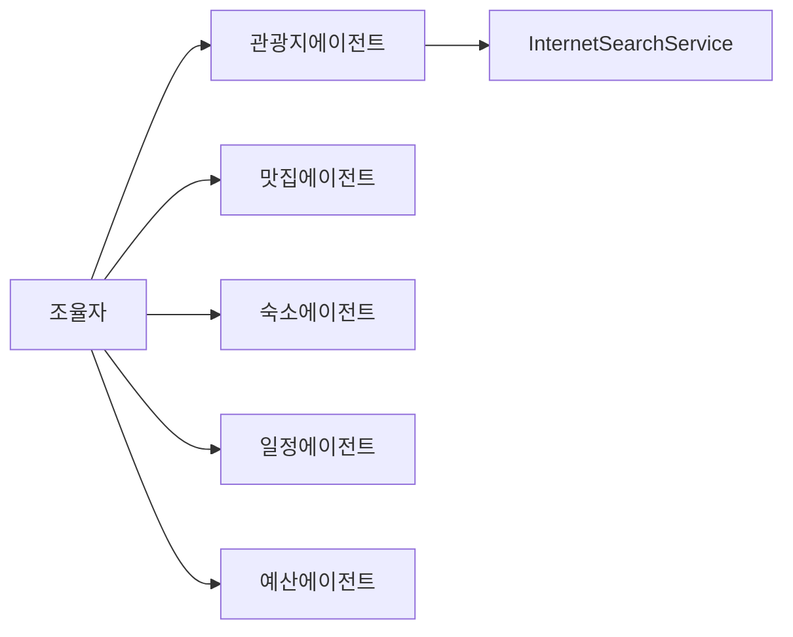

# 에이전트 참고 (한국어 번역)

이 문서는 모듈 내 각 에이전트의 책임과 주요 동작을 요약합니다.

- `AttractionAgent`
  - `InternetSearchService`를 사용해 관광지를 검색합니다 (`searchAttractions`, `fetchAttractionInfo`).
  - `Attraction` DTO 목록을 반환하고 `entranceFee`가 없을 경우 보정합니다.
  - 시스템 프롬프트는 JSON 배열 출력 강제를 포함하며, 파싱 실패 시 한 번 수리(repair) 프롬프트로 재시도합니다.

- `RestaurantAgent`
  - 맛집을 검색하고 결과를 보강합니다. 가격(`price`) 정보가 없을 경우 휴리스틱으로 보정합니다.
  - 검색/상세조회용 도구(`searchRestaurants`, `fetchRestaurantInfo`)를 제공합니다.

- `AccommodationAgent`
  - 숙소 정보를 수집하고 1박 가격을 정규화합니다 (유사 패턴 적용).

- `PlanAgent`
  - 수집된 DTO들을 바탕으로 상세한 여행 일정 프롬프트를 생성하고, LLM에게 `Plan` 엔티티 생성을 요청합니다.
  - 출력 형식과 비용 계산 규칙을 프롬프트에 명시해 기계 친화적인 결과를 유도합니다.

- `BudgetAgent`
  - 생성된 일정의 비용을 `PlanState.maxBudget`과 비교 분석하여 `BudgetAnalysis`를 설정합니다.

참고

- 에이전트는 `ChatClient.entity(...)`를 통해 강한 타입 DTO 반환을 선호하며, LLM이 잘못된 JSON을 반환할 경우 방어적으로 수리 메시지를 보내 재시도합니다.
- `@Tool` 어노테이션과 `returnDirect=true`는 조율자에게 직접 결과를 반환할 때 사용됩니다.
