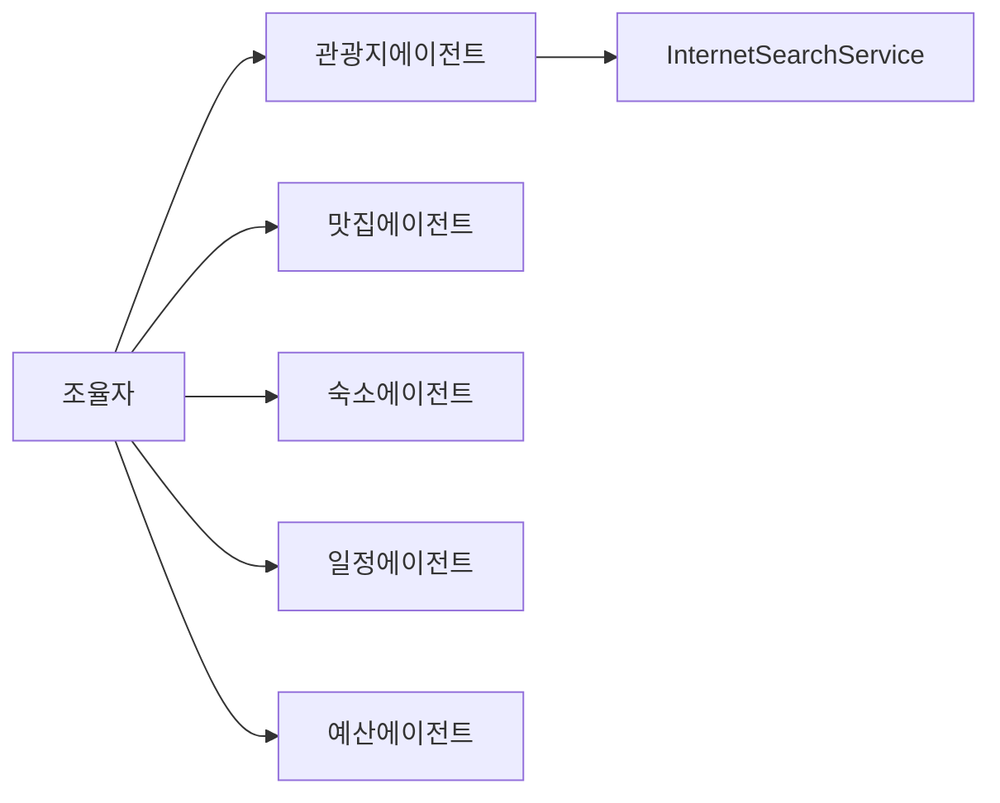

# 에이전트 참고 (한국어 번역)



이 문서는 모듈 내 각 에이전트의 책임과 주요 동작을 요약합니다.

- `AttractionAgent`
  - `InternetSearchService`를 사용해 관광지를 검색합니다 (`searchAttractions`, `fetchAttractionInfo`).
  - `Attraction` DTO 목록을 반환하고 `entranceFee`가 없을 경우 보정합니다.
  - 시스템 프롬프트는 JSON 배열 출력 강제를 포함하며, 파싱 실패 시 한 번 수리(repair) 프롬프트로 재시도합니다.

- `RestaurantAgent`
  - 맛집을 검색하고 결과를 보강합니다. 가격(`price`) 정보가 없을 경우 휴리스틱으로 보정합니다.
  - 검색/상세조회용 도구(`searchRestaurants`, `fetchRestaurantInfo`)를 제공합니다.

- `AccommodationAgent`
  - 숙소 정보를 수집하고 1박 가격을 정규화합니다 (유사 패턴 적용).

- `PlanAgent`
  - 수집된 DTO들을 바탕으로 상세한 여행 일정 프롬프트를 생성하고, LLM에게 `Plan` 엔티티 생성을 요청합니다.
  - 출력 형식과 비용 계산 규칙을 프롬프트에 명시해 기계 친화적인 결과를 유도합니다.

- `BudgetAgent`
  - 생성된 일정의 비용을 `PlanState.maxBudget`과 비교 분석하여 `BudgetAnalysis`를 설정합니다.

참고

- 에이전트는 `ChatClient.entity(...)`를 통해 강한 타입 DTO 반환을 선호하며, LLM이 잘못된 JSON을 반환할 경우 방어적으로 수리 메시지를 보내 재시도합니다.
- `@Tool` 어노테이션과 `returnDirect=true`는 조율자에게 직접 결과를 반환할 때 사용됩니다.

알아야 할 내용

- DTO 우선: `Attraction`, `Restaurant`, `Accommodation`, `Plan`, `BudgetAnalysis` 같은 간단한 POJO를 정의하세요. `ChatClient.entity(...)`로 매핑합니다.
- 프롬프트 설계: 짧은 시스템 프롬프트, 기대 JSON 스키마 예시, 그리고 수리(repair) 지시를 포함하세요.

예제 프롬프트(의사코드)

```
System: 당신은 여행 데이터 추출 전문가입니다. 항상 스키마에 맞는 유효한 JSON을 반환하세요.
User: 다음 텍스트로부터 Attraction 객체 배열을 반환하세요: [{"name":"...","location":"...","entranceFee":12345}]
Repair: 응답이 유효한 JSON이 아니면 수정하여 JSON만 출력하세요.
```

오류 처리 및 재시도

- `ChatClient.entity(...)` 파싱 실패 시 수리 프롬프트를 보내 한 번 재시도하세요.
- 디버깅을 위해 원본 LLM 출력(비밀 제외)을 로깅합니다.

구현 팁

- JSON 수리 로직을 헬퍼로 중앙화하면 모든 에이전트에서 재시도 동작을 일관되게 유지할 수 있고 테스트가 쉬워집니다.

에이전트 프롬프트 및 DTO 예시

`AttractionAgent` (파일: `AttractionAgent.java`) 프롬프트 예시:
```
당신은 관광지 추천 전문 에이전트입니다.
규칙: 관광지 후보는 최소 3개, 최대 6개.
출력 형식: 반드시 JSON 배열만 출력
예) [{"name":"...","address":"...","description":"...","entranceFee":5000}]
```

DTO 예시 (`com.example.demo.dto.Attraction`):
```java
@Data
public class Attraction {
  private String name;
  private String address;
  private String description;
  private Integer entranceFee;
}
```

`RestaurantAgent` 프롬프트 예시 및 DTO (`Restaurant`):
```
당신은 맛집 추천 전문 에이전트입니다. 맛집 후보는 3~5개, JSON 배열만 출력하세요.
예) [{"name":"...","address":"...","description":"...","price":12000}]
```

DTO 예시 (`com.example.demo.dto.Restaurant`):
```java
@Data
public class Restaurant {
  private String name;
  private String address;
  private String description;
  private Integer price;
}
```

`AccommodationAgent` 프롬프트 예시 및 DTO (`Accommodation`):
```
당신은 숙소 추천 전문 에이전트입니다. JSON 배열로 숙소 후보 반환.
예) [{"name":"...","address":"...","description":"...","pricePerNight":150000}]
```

DTO 예시 (`com.example.demo.dto.Accommodation`):
```java
@Data
public class Accommodation {
  private String name;
  private String address;
  private String description;
  private Integer pricePerNight;
}
```

`PlanAgent`의 출력 DTO 예시 (`com.example.demo.dto.Plan`) 간단화:
```java
@Data
public class Plan {
  private List<DaySchedule> days;
  private Integer maxBudget;
  private Integer totalCost;
  private Integer meals;
  private Integer accommodation;
  private Integer attractions;
}
```
