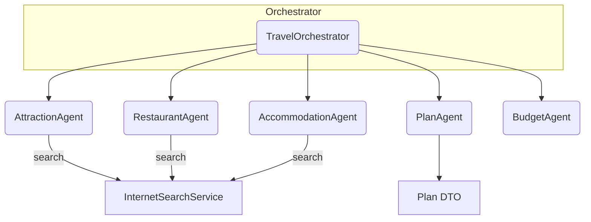

# Architecture

Overview

- The system uses a central orchestrator (`TravelOrchestrator`) that exposes tool methods. An LLM interacting with the orchestrator can choose which tool (agent) to invoke.
- Each agent is a focused component responsible for one domain (attractions, restaurants, accommodations, planning, budget analysis).
- Agents call external services (e.g., `InternetSearchService`) and return typed DTOs. The orchestrator assembles these DTOs into a `Plan`.

Key flows

1. Parse user request: `TravelOrchestrator.parseUserQuery()` uses an LLM to extract structured requirements (`Requirements`) from free text.
2. Collect info in parallel: `collectTravelInfoInParallel()` runs Attraction/Restaurant/Accommodation agents concurrently, propagating SSE emitters to worker threads.
3. Plan generation: `PlanAgent.execute()` builds a single-plan prompt and asks the LLM to return a `Plan` entity.
4. Budget analysis and replan: `BudgetAgent.execute()` validates costs and triggers `replanWithAdjustedBudget()` when needed.

Integration points

- ChatClient: built via a `ChatClient.Builder` and used to call LLMs, map responses to entities, or collect textual content.
- Tools: methods annotated with `@Tool` allow the LLM to select and call agents programmatically.
- SSE: `SseEmitter` events are emitted during agent execution for UI progress updates.

What to know

- Single responsibility: agents should be narrowly focused and return typed DTOs where practical.
- Tool semantics: `@Tool` methods are the bridge between the orchestrator and agents; design them to be idempotent and side-effect safe.
- Threading: the orchestrator may spawn multiple worker threads; use `InheritableThreadLocal` carefully to pass `SseEmitter` instances and avoid shared mutable state.

Example: request flow

1. The user sends a free-text request.
2. `TravelOrchestrator.parseUserQuery()` calls an LLM to extract structured `Requirements`.
3. The orchestrator concurrently invokes agent tools (Attraction/Restaurant/Accommodation) to collect domain DTOs.
4. `PlanAgent` composes these DTOs and requests a final `Plan` entity from the LLM.
5. `BudgetAgent` verifies costs and optionally triggers a replan.

Extra tips

- Use explicit JSON examples in prompts and add a repair prompt to handle malformed outputs.
- Instrument each agent with latency and token-usage metrics to identify expensive steps.
- For production, separate LLM provider adapters and centralize retry/backoff logic.
