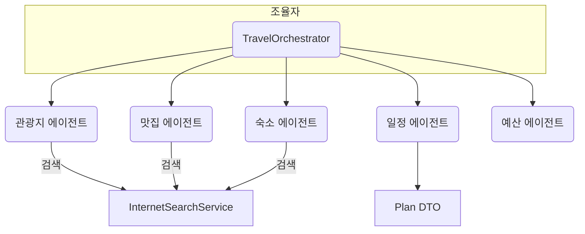

# 아키텍처 (한국어 번역)

개요

- 이 모듈은 도구 기반의 중앙 조율자(Orchestrator)와 여러 전문 에이전트로 구성됩니다. `TravelOrchestrator`는 도구 메서드를 외부에 노출하여, LLM이 적절한 에이전트를 선택해 호출할 수 있도록 합니다.
- 각 에이전트는 관광지, 맛집, 숙소, 일정 작성, 예산 분석 등 한 가지 도메인에 집중하는 경량 컴포넌트입니다.
- 에이전트는 외부 서비스(예: `InternetSearchService`)를 호출하여 결과를 수집하고, 타입이 지정된 DTO로 반환합니다. 조율자는 이 DTO들을 모아 최종 `Plan`을 구성합니다.

주요 흐름

1. 사용자 요청 파싱: `TravelOrchestrator.parseUserQuery()`는 LLM을 사용해 자유 텍스트에서 구조화된 요구사항(`Requirements`)을 추출합니다.
2. 정보 병렬 수집: `collectTravelInfoInParallel()`은 Attraction/Restaurant/Accommodation 에이전트를 병렬로 실행하고, SSE 이벤트 전송을 위해 emitter를 작업 스레드로 전달합니다.
3. 일정 생성: `PlanAgent.execute()`는 수집된 DTO들을 바탕으로 단일 프롬프트를 작성해 LLM에게 `Plan` 엔티티 생성을 요청합니다.
4. 예산 분석 및 재계획: `BudgetAgent.execute()`가 비용을 검증하고 필요 시 `replanWithAdjustedBudget()`를 호출해 재계획을 수행합니다.

통합 지점

- `ChatClient`: `ChatClient.Builder`로 생성되며, LLM 호출, 엔티티 매핑, 텍스트 수집 등에 사용됩니다.
- 도구(Tools): `@Tool` 어노테이션이 붙은 메서드는 LLM이 프로그램적으로 에이전트를 호출할 수 있게 해 줍니다.
- SSE: 에이전트 실행 중 UI로 실시간 진행 상황을 알리기 위해 `SseEmitter` 이벤트를 전송합니다.
