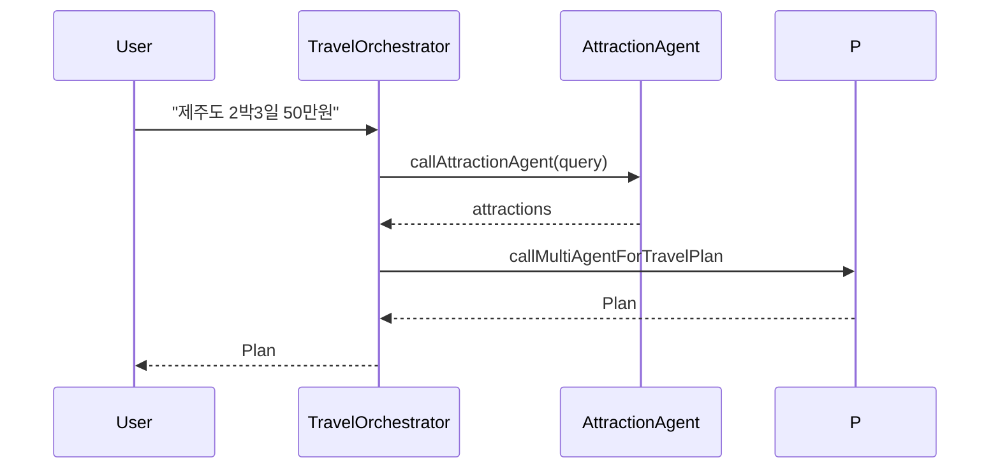

# Run & examples

Build

- From workspace root (recommended):

  - `./gradlew :ch14-multi-agent:bootJar`

- Or change into module and run:

  - `cd ch14-multi-agent && ../gradlew bootRun`

Running notes

- If you use `bootRun` with JVM system properties, pass them to the application JVM using `spring-boot.run.jvmArguments` in Gradle, for example:

  - `./gradlew :ch14-multi-agent:bootRun -Pspring-boot.run.jvmArguments="-Dspring.profiles.active=local"`

- For deterministic runs or to set LLM credentials, build a jar and run with `java -D... -jar`:

  - `./gradlew :ch14-multi-agent:bootJar`
  - `java -DOPENAI_API_KEY=... -jar ch14-multi-agent/build/libs/ch14-multi-agent-*.jar`

Testing the orchestrator (quick):

- Use HTTP or the included controller (if present) to send a user query like: `제주도 2박3일 50만원` and observe SSE events for agent progress.

Logging & debugging

- Agents emit descriptive logs and attempt a JSON repair pass if the LLM returns non-JSON. Check logs for repair attempts and parsing errors.
