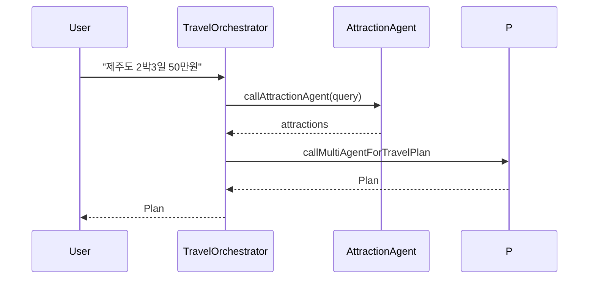

# Run & examples



Build

- From workspace root (recommended):

  - `./gradlew :ch14-multi-agent:bootJar`

- Or change into module and run:

  - `cd ch14-multi-agent && ../gradlew bootRun`

Running notes

- If you use `bootRun` with JVM system properties, pass them to the application JVM using `spring-boot.run.jvmArguments` in Gradle, for example:

  - `./gradlew :ch14-multi-agent:bootRun -Pspring-boot.run.jvmArguments="-Dspring.profiles.active=local"`

- For deterministic runs or to set LLM credentials, build a jar and run with `java -D... -jar`:

  - `./gradlew :ch14-multi-agent:bootJar`
  - `java -DOPENAI_API_KEY=... -jar ch14-multi-agent/build/libs/ch14-multi-agent-*.jar`

Testing the orchestrator (quick):

- Use HTTP or the included controller (if present) to send a user query like: `제주도 2박3일 50만원` and observe SSE events for agent progress.

Logging & debugging

- Agents emit descriptive logs and attempt a JSON repair pass if the LLM returns non-JSON. Check logs for repair attempts and parsing errors.

End-to-end example (HTTP)

1. Start the application:

```bash
cd ch14-multi-agent
../gradlew bootRun
```

2. Send a POST request to the orchestrator endpoint (example using curl):

```bash
# Actual controller endpoint (see `AiController`):
# GET /api/ai/chat?message=...  (returns SSE stream)

# Example: open an SSE connection with curl (replace message URL-encoded)
curl -N "http://localhost:8080/api/ai/chat?message=%EC%A0%9C%EC%A3%BC%EB%8F%84%202%EB%B0%953%EC%9D%BC%2050%EB%A7%8C%EC%9B%90"
```

3. Expected flow:
- SSE events stream progress (agents starting/completing).
- Final response contains a JSON `Plan` object with days, activities, costs, and summary.

Sample expected `Plan` (simplified):

```json
{
  "title":"제주 2박3일",
  "days":[
    {"day":1,"activities":[{"time":"09:00","place":"한라산","cost":0}]},
    {"day":2,"activities":[{"time":"10:00","place":"성산일출봉","cost":20000}]}
  ],
  "totalCost":450000
}
```

Notes

- The exact endpoint path depends on the module's controller; inspect `HomeController` / `AiController` for concrete routes.
Notes

- Available endpoints (from code):
  - `GET /api/ai/chat?message={text}` — Start multi-agent processing and stream SSE events. Returns `SseEmitter`.
  - `GET /travel-multi-agent` — UI page for demo (Thymeleaf template).
  - `GET /` — Module home page.

- Example response behavior:
  - SSE events named `message` stream partial or final JSON results.
  - A `complete` event signals end of stream.

- For testing without SSE, you can call orchestrator methods directly in unit tests or mock `ChatClient`.
- For reproducible testing, mock `ChatClient` responses in tests to avoid calling remote LLMs.
