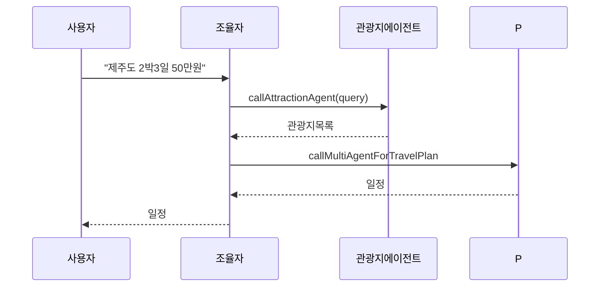

# 실행 및 예제 (한국어 번역)



빌드

- 워크스페이스 루트에서 권장:

  - `./gradlew :ch14-multi-agent:bootJar`

- 또는 모듈 디렉터리로 이동하여 실행:

  - `cd ch14-multi-agent && ../gradlew bootRun`

실행 관련 주의

- `bootRun`으로 JVM 시스템 프로퍼티를 전달할 때는 Gradle의 `spring-boot.run.jvmArguments`를 사용하세요. 예:

  - `./gradlew :ch14-multi-agent:bootRun -Pspring-boot.run.jvmArguments="-Dspring.profiles.active=local"`

- JAR을 만들어 `java -D... -jar`로 실행하면 프로퍼티 전달이 확실합니다:

  - `./gradlew :ch14-multi-agent:bootJar`
  - `java -DOPENAI_API_KEY=... -jar ch14-multi-agent/build/libs/ch14-multi-agent-*.jar`

간단한 조율자 테스트:

- 컨트롤러(있다면)를 통해 `제주도 2박3일 50만원` 같은 쿼리를 보내고, 에이전트 진행을 SSE 이벤트로 관찰해보세요.

로깅 및 디버깅

- 에이전트는 파싱 실패 시 수리 시도를 로그로 남깁니다. 로그에서 수리 시도와 파싱 오류를 확인하세요.

엔드 투 엔드 예시 (HTTP)

1. 애플리케이션 시작:

```bash
cd ch14-multi-agent
../gradlew bootRun
```

2. 실제 컨트롤러 엔드포인트 (코드: AiController)는 SSE를 사용합니다:

```bash
# GET /api/ai/chat?message={text} — SSE 스트림을 반환합니다. 메시지는 URL 인코딩하세요.
curl -N "http://localhost:8080/api/ai/chat?message=%EC%A0%9C%EC%A3%BC%EB%8F%84%202%EB%B0%953%EC%9D%BC%2050%EB%A7%8C%EC%9B%90"
```

3. 예상 흐름:
- SSE 이벤트로 에이전트 진행상황을 스트리밍합니다.
- 최종 응답은 `days`, `activities`, `costs` 등을 포함한 JSON `Plan` 객체를 반환합니다.

샘플 `Plan`(간단화):

```json
{
  "title":"제주 2박3일",
  "days":[
    {"day":1,"activities":[{"time":"09:00","place":"한라산","cost":0}]},
    {"day":2,"activities":[{"time":"10:00","place":"성산일출봉","cost":20000}]}
  ],
  "totalCost":450000
}
```

노트

- 코드에 정의된 엔드포인트:
  - `GET /api/ai/chat?message={text}` — 멀티 에이전트 처리를 시작하고 SSE 이벤트를 스트리밍합니다. 반환형은 `SseEmitter`.
  - `GET /travel-multi-agent` — 데모용 UI 템플릿 페이지.
  - `GET /` — 홈 페이지.

- SSE 동작:
  - 서버는 진행 중인 결과를 `message` 이벤트로 순차 전송합니다 (부분 JSON 또는 텍스트).
  - 모든 처리가 끝나면 `complete` 이벤트를 전송하여 스트림을 닫습니다.

- 재현 가능한 테스트를 위해 유닛 테스트에서는 조율자 메서드를 직접 호출하거나 `ChatClient`를 모킹하세요.
