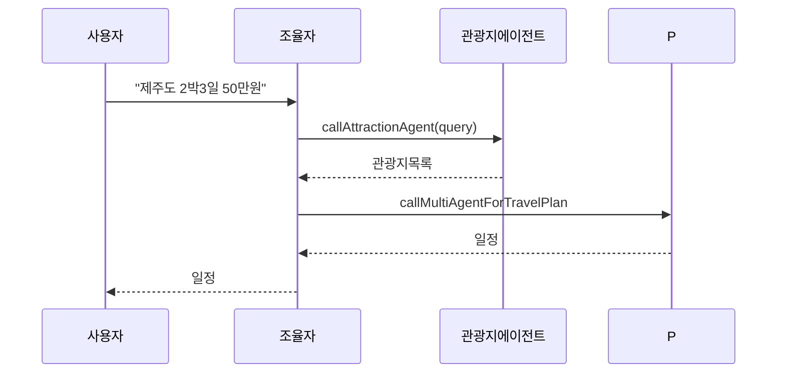

# 실행 및 예제 (한국어 번역)

빌드

- 워크스페이스 루트에서 권장:

  - `./gradlew :ch14-multi-agent:bootJar`

- 또는 모듈 디렉터리로 이동하여 실행:

  - `cd ch14-multi-agent && ../gradlew bootRun`

실행 관련 주의

- `bootRun`으로 JVM 시스템 프로퍼티를 전달할 때는 Gradle의 `spring-boot.run.jvmArguments`를 사용하세요. 예:

  - `./gradlew :ch14-multi-agent:bootRun -Pspring-boot.run.jvmArguments="-Dspring.profiles.active=local"`

- JAR을 만들어 `java -D... -jar`로 실행하면 프로퍼티 전달이 확실합니다:

  - `./gradlew :ch14-multi-agent:bootJar`
  - `java -DOPENAI_API_KEY=... -jar ch14-multi-agent/build/libs/ch14-multi-agent-*.jar`

간단한 조율자 테스트:

- 컨트롤러(있다면)를 통해 `제주도 2박3일 50만원` 같은 쿼리를 보내고, 에이전트 진행을 SSE 이벤트로 관찰해보세요.

로깅 및 디버깅

- 에이전트는 파싱 실패 시 수리 시도를 로그로 남깁니다. 로그에서 수리 시도와 파싱 오류를 확인하세요.
